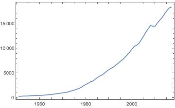
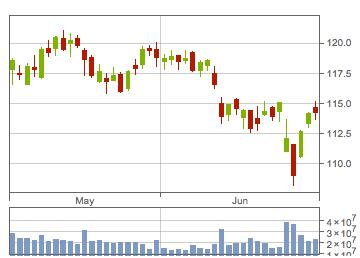
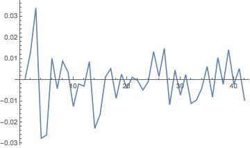

# QuandlLink

QuandlLink is the Mathematica client to get data from
[Quandl](https://www.quandl.com/).

##  Instructions to install QuandlLink package in Mathematica.

- Download QuandlLink folder and put it in Applications folder of either $UserBaseDirectory or $BaseDirectory of Mathematica. These location can be opened by evaluating following in Mathematica notebook:

SystemOpen[FileNameJoin[{$BaseDirectory, "Applications"}]]
SystemOpen[FileNameJoin[{$UserBaseDirectory, "Applications"}]]


## Some example

### US annual GDP

```mathematica
In[1]:= usgdp = QuandlFinancialData["datasets/FRED/GDP",
  startDate -> "1950-01-01", endDate -> "2016-06-01",
  collapse -> "annual", apiKey -> "you_api_key",
  sortOrder -> "desc"]
```

```mathematica
Out[1]:= {{"DATE", "VALUE"}, {"2016-12-31", 18437.6}, {"2015-12-31",
  18222.8}, {"2014-12-31", 17692.2}, {"2013-12-31",
  16999.9}, {"2012-12-31", 16297.3}, {"2011-12-31",
  15785.3}, {"2010-12-31", 15230.2}, {"2009-12-31",
  14566.5}, {"2008-12-31", 14549.9}, {"2007-12-31",
  14685.3}, {"2006-12-31", 14066.4}, {"2005-12-31",
  13381.6}, {"2004-12-31", 12562.2}, {"2003-12-31",
  11816.8}, {"2002-12-31", 11103.8}, {"2001-12-31",
  10701.3}, {"2000-12-31", 10472.3}, {"1999-12-31",
  9926.1}, {"1998-12-31", 9325.7}, {"1997-12-31",
  8788.3}, {"1996-12-31", 8287.1}, {"1995-12-31",
  7799.5}, {"1994-12-31", 7476.7}, {"1993-12-31",
  7032.8}, {"1992-12-31", 6697.6}, {"1991-12-31",
  6279.3}, {"1990-12-31", 6023.3}, {"1989-12-31",
  5763.4}, {"1988-12-31", 5412.7}, {"1987-12-31",
  5022.7}, {"1986-12-31", 4669.4}, {"1985-12-31",
  4453.1}, {"1984-12-31", 4147.6}, {"1983-12-31",
  3796.1}, {"1982-12-31", 3407.8}, {"1981-12-31",
  3283.5}, {"1980-12-31", 2993.5}, {"1979-12-31",
  2730.7}, {"1978-12-31", 2482.2}, {"1977-12-31",
  2168.7}, {"1976-12-31", 1938.4}, {"1975-12-31",
  1765.9}, {"1974-12-31", 1603.}, {"1973-12-31",
  1479.1}, {"1972-12-31", 1332.}, {"1971-12-31",
  1193.6}, {"1970-12-31", 1091.5}, {"1969-12-31",
  1040.7}, {"1968-12-31", 970.1}, {"1967-12-31",
  883.2}, {"1966-12-31", 834.9}, {"1965-12-31", 773.1}, {"1964-12-31",
   698.4}, {"1963-12-31", 654.8}, {"1962-12-31",
  613.1}, {"1961-12-31", 581.6}, {"1960-12-31", 541.1}, {"1959-12-31",
   529.3}, {"1958-12-31", 500.4}, {"1957-12-31",
  475.7}, {"1956-12-31", 461.3}, {"1955-12-31", 437.8}, {"1954-12-31",
   400.3}, {"1953-12-31", 386.5}, {"1952-12-31",
  381.2}, {"1951-12-31", 356.6}, {"1950-12-31", 320.3}}
```

Plot the result

```mathematica
In[2]:= DateListPlot[Rest[%]]
```

.


### Facebook stock price

```mathematica
In[4]:= fbstock =
  QuandlFinancialData["datasets/WIKI/FB",
   apiKey -> "you_api_key", startDate -> "2016-05-01",
   endDate -> "2016-06-30"];
```

Plot the trading graph of facebook's stock.

```mathematica
TradingChart[Map[{First @ #, #[[2 ;; 6]]} &, Rest[%]]]
```

.

We can also do some transformation by using `transform` parameter.

```mathematica
In[5]:= fbchange =
 QuandlFinancialData["datasets/WIKI/FB",
  apiKey -> "you_api_key", startDate -> "2016-05-01",
  endDate -> "2016-06-30", transform -> "rdiff",
  extra -> <| "column_index" -> "4"|>]
```

Plot the change

```mathematica
In[6]:= ListLinePlot[Map[#[[2]] &, Rest[fbchange]]]
```

.

### Filter rows and columns

Some dataset are filterable by row and column.  In QuandlLink you can use
an association in the `extra` option to do that. Like the following example.


```mathematica
In[7]:= filterRows =
 QuandlFinancialData["datatables/INQ/EE", apiKey -> "you_api_key",
  extra -> <|"qopts.columns" -> "company", "isin" -> "FI0009000681" |>]
```

```mathematica
Out[7]:= {{"company"}, {"NOKIA"}, {"NOKIA"}, {"NOKIA"}}
```

```mathematica
In[8]:= filterMultiRowsAndCols =
 QuandlFinancialData["datatables/INQ/EE", apiKey -> "you_api_key",
  extra -> <|"qopts.columns" -> {"company", "isin"},
    "isin" -> {"FI0009000681", "DE0007236101"}|>]
```

```mathematica
Out[8]:= {{"company", "isin"}, {"NOKIA", "FI0009000681"}, {"NOKIA",
  "FI0009000681"}, {"NOKIA", "FI0009000681"}, {"SIEMENS",
  "DE0007236101"}, {"SIEMENS", "DE0007236101"}, {"SIEMENS",
  "DE0007236101"}}
```

For more information, please refer [Quandl API doc](https://www.quandl.com/docs/api).
